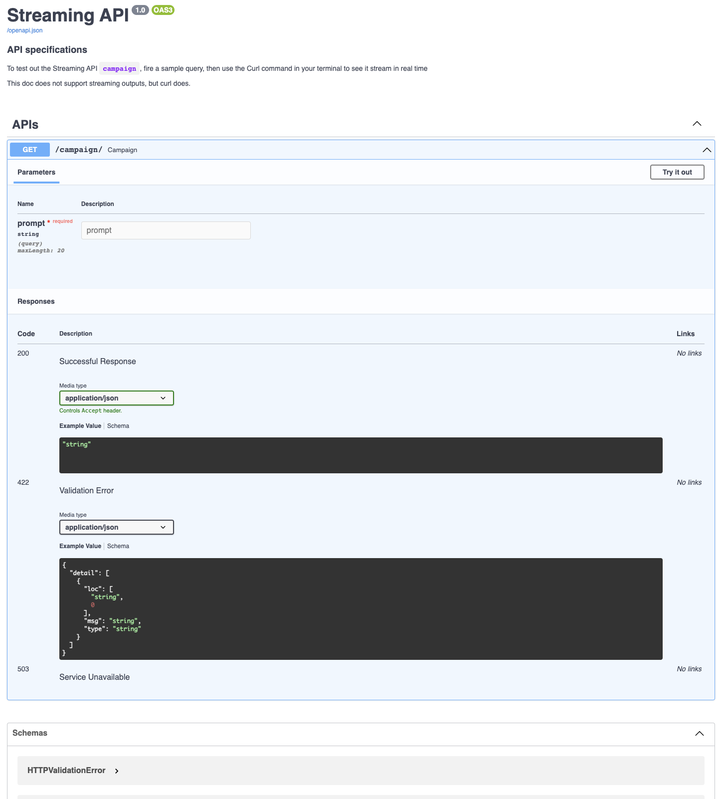

# StreamingFastAPI

## Read the blog [here](https://tech.clevertap.com/streaming-openai-app-in-python/)

Very basic FastAPI app that uses OpenAI APIs to stream responses

Set OPENAI_API_KEY environment variable using `export OPENAI_API_KEY=<your_api_key>`

Install packages using `pip install -r requirements.txt`

Run using `uvicorn fastapp:app` (use `--reload` flag for debugging)

Navigate to http://127.0.0.1:8000/docs to find documentation and test the API

